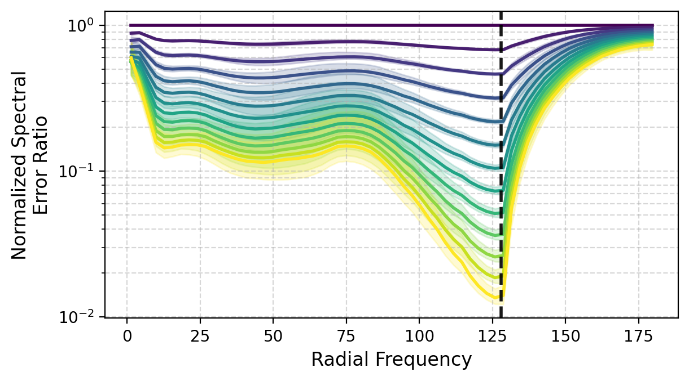
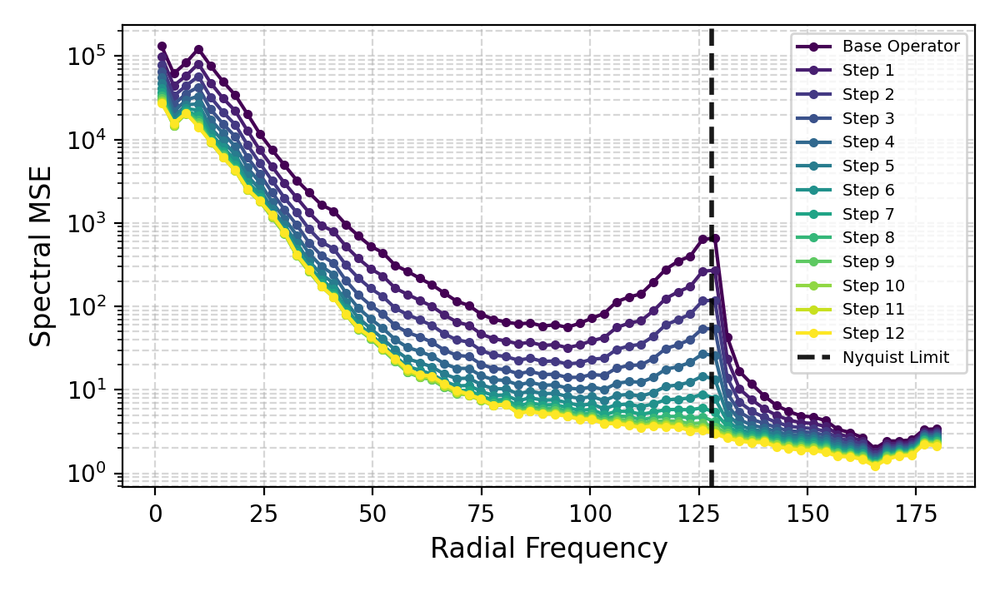

# Iterative Refinement Neural Operators are Learned Fixed-Point Solvers

**A Principled Approach to Spectral Bias Mitigation**

[Xiaotian Liu](https://xiaotianliu-dartmouth.github.io/)¹ · [Shuyuan Shang](https://www.linkedin.com/in/shuyuan-shang-860ab3348/)² · [Xiaopeng Wang](https://stephenw830.github.io/)¹ · [Pu Ren](https://paulpuren.github.io/)³ · [Yaoqing Yang](https://sites.google.com/site/yangyaoqingcmu/)¹

¹ Dartmouth College · ² CUHK-Shenzhen · ³ Lawrence Berkeley National Lab

**ICML 2026 · Spotlight**

[](https://xiaotianliu-dartmouth.github.io/IRNO_ICML_26_Spotlight/)
[](https://arxiv.org/abs/ARXIV_ID)
[](https://xiaotianliu-dartmouth.github.io/IRNO_ICML_26_Spotlight/static/pdfs/IRNO_slides.pdf)

---

## TL;DR

IRNO treats operator prediction not as a one-shot map, but as an iterative refinement process. It augments a **frozen pretrained neural operator** with a shared-weight refinement module that iteratively corrects residual errors via fixed-point iteration — recovering fine-scale structures that single-pass operators smooth out.

- **Plug-and-play**: wraps any pretrained operator with no retraining or architectural changes
- **Theoretically grounded**: contraction mapping guarantee with a closed-form error floor bound
- **Spectrally aware**: progressive spectral loss that increasingly emphasizes high-frequency recovery
- **Up to 56% VRMSE reduction** on turbulent flow, stable beyond the training iteration count

---

## Method

```
h₀ = T_base(x)                   # Frozen base operator: coarse initialization
h_{k+1} = h_k + α · Φ_θ(x, h_k) # Shared-weight refinement: iterative correction
```

A progressive spectral loss targets high-frequency residuals across refinement steps. A fixed-point regularizer `L_fp = ||Φ_θ(x, y)||²` minimizes the bias at the true solution, directly tightening the convergence bound.


---

## Results

| Dataset | Metric | Base | Initial | IRNO (Ours) | Improvement |
|---|---|---|---|---|---|
| TR-2D (Turbulent Flow) | VRMSE ↓ | FNO | 0.2394 | **0.1309** | 45.32% |
| | | TFNO | 0.2371 | **0.1042** | **56.05%** |
| Active Matter | VRMSE ↓ | FNO | 0.1017 | **0.0501** | 50.73% |
| | | TFNO | 0.1981 | **0.0387** | **80.46%** |
| ERA5 16× SR | ACC ↑ | FNO | 0.7523 | **0.892** | 18.59% |
| | RFNE ↓ | FNO | 0.3247 | **0.214** | **34.09%** |

ERA5 16× comparison against spectral state-of-the-art (IRNO uses WDSR as base):

| Method | ACC ↑ | RFNE ↓ |
|---|---|---|
| ResUNet-HFS | 0.892 | 0.225 |
| HiNOTE | 0.906 | 0.222 |
| **IRNO (Ours)** | **0.910** | **0.195** |

Error decreases monotonically across steps and remains stable well beyond the training cutoff K (dashed line), confirming contraction dynamics.

## Spectral Dynamics

<table>
  <tr>
    <td></td>
    <td></td>
  </tr>
  <tr>
    <td align="center">(a) Median normalized spectral error ratios across the test set.</td>
    <td align="center">(b) Instance-level spectral MSE for a representative test sample.</td>
  </tr>
</table>
IRNO consistently attenuates mid-to-high frequency error across refinement steps, remaining stable beyond the training cutoff K.
---

## Installation

```bash
pip install -r requirements.txt
```

**Dependencies**: PyTorch ≥ 2.0, `the-well`, `neuralop`, `einops`, `PyYAML`, `numpy`, `matplotlib`

---

## Quick Start

### 1. Configure

Edit `config.yaml` to set your dataset path and base model:

```yaml
model:
  base:
    pretrained_name: "polymathic-ai/FNO-active_matter"

dataset:
  base_path: "/path/to/datasets"
```

### 2. Train

```bash
python train.py --config config.yaml
```

### 3. Evaluate

```bash
python evaluate.py --config config.yaml --checkpoint checkpoints/best_model.pth
```

---

## Configuration Reference

```yaml
training:
  K: 6          # Training horizon (refinement steps)
  alpha: 0.2    # Step size

  spectral_loss:
    enabled: true
    weight: 1.0
    lambda_start: 1.0   # Progressive exponent start
    lambda_end: 2.0     # Progressive exponent end (higher = more HF emphasis)

  fixed_point_reg:
    enabled: true
    weight: 0.01        # β_fp: scales bias-floor regularization

model:
  refinement:
    base_channels: 16
    depth: 4
    padding_type: "circular"  # For periodic domains
    norm_type: "layer"        # "batch" | "layer" | "group"
```

---

## Project Structure

```
IRNO/
├── config.yaml          # Training configuration
├── train.py             # Training script
├── evaluate.py          # Evaluation script
├── requirements.txt     # Dependencies
├── data/
│   └── download_data.py # Dataset download utility
├── models/
│   ├── model.py         # RefinementOperator (Φ_θ): U-Net with circular padding
│   └── losses.py        # Spatial, progressive spectral, and fixed-point losses
└── utils/
    ├── config_loader.py # YAML config loader
    └── metrics.py       # VRMSE computation
```

---

## BibTeX

```bibtex
@inproceedings{liu2026irno,
  title     = {Iterative Refinement Neural Operators are Learned Fixed-Point Solvers:
               A Principled Approach to Spectral Bias Mitigation},
  author    = {Liu, Xiaotian and Shang, Shuyuan and Wang, Xiaopeng and Ren, Pu and Yang, Yaoqing},
  booktitle = {Proceedings of the 43rd International Conference on Machine Learning},
  year      = {2026}
}
```
